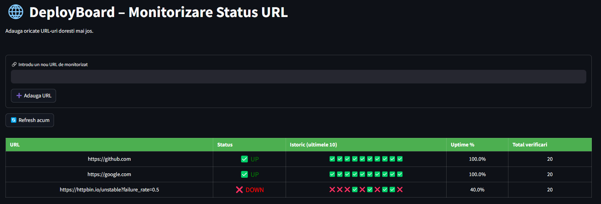

# 🚀 DeployBoard – Cloud-native Monitoring Dashboard

A simple yet powerful health check dashboard for monitoring websites and services. Built as a learning project for DevOps & Cloud Engineering.


---

## 📌 Overview

DeployBoard is a monitoring dashboard designed to check the health, uptime, and response time of various web services.

✅ Easy to configure  
✅ Dockerized + CI/CD via GitHub Actions  
✅ Deployed in the cloud (GCP / Railway / Vercel)

---

## ⚙️ Tech Stack

- **Python** – scripting & backend logic  
- **Docker** – containerized deployment  
- **GitHub Actions** – CI/CD automation  
- **Google Cloud Run / Railway** – cloud hosting  
- **(Optional)** Prometheus + Grafana for metrics  
- **Markdown + HTML** – status output

---

## 🛠️ Local Development Setup

```bash
# Clone repo
git clone https://github.com/claudebadoi/DeployBoard.git
cd DeployBoard

# Run locally (Python)
python health_check.py

# Or using Docker
docker build -t deployboard .
docker run deployboard
```

---

## 🎥 Demo & Screenshots

> 📹 [Click to watch Loom demo](https://loom.com/YOUR-VIDEO) *(coming soon)*



---

## 🚧 Planned Features

- [x] Health check script with logging  
- [x] JSON output + timestamp  
- [x] GitHub Actions automation  
- [ ] Notification system via email/Slack  
- [ ] Web frontend (FastAPI or Flask)  
- [ ] Grafana integration (optional)

---

---

## 📝 License

This project is licensed under the MIT License.
